# Homelab Security Architecture

A personal homelab used to develop hands-on experience with network security, Linux administration, virtualization, firewall policy, storage, self-hosted services, and defensive security monitoring.

The environment is built around **OPNsense**, **Proxmox**, **TrueNAS**, and segmented networks for personal devices, servers, and IP cameras.

## Architecture

### Physical Topology

Internet connectivity enters through a cable modem and is routed through a **Sophos XG 125 Rev.3 running OPNsense**.

OPNsense connects to a **D-Link DGS-1210-24P managed switch**, which provides the central switching and VLAN infrastructure for the network.

From the managed switch:

* A **2.5 GbE unmanaged switch** connects the primary server infrastructure:

  * ZimaBoard running Proxmox
  * HP EliteDesk mini PC running Proxmox
  * ZimaBlade running TrueNAS

* A **1 GbE unmanaged switch** connects:

  * Desktop workstation
  * Netgear router configured in access point mode

* A separate **1 GbE unmanaged switch** connects the wired IP cameras.

The Netgear device operates only as a wireless access point on the personal network. Routing, firewalling, DHCP/network policy, and inter-VLAN traffic control are handled by OPNsense.

## Network Segmentation

The network is divided into separate security zones based on device purpose and trust level.

| Network  | Subnet           | Purpose                                                                        |
| -------- | ---------------- | ------------------------------------------------------------------------------ |
| Personal | `192.168.1.0/24` | Personal computers, mobile devices, wireless clients, and trusted user devices |
| Cameras  | `10.0.11.0/24`   | Wired IP surveillance cameras                                                  |
| Servers  | `10.0.30.0/24`   | Proxmox hosts, TrueNAS, VMs, containers, and self-hosted services              |

### Access Policy

**Personal → Servers**

Trusted devices on the personal network are permitted to access services hosted on the server VLAN.

**Cameras**

The camera network is isolated from the rest of the environment through OPNsense firewall policy.

Camera Internet access is restricted by default. Required communication is permitted for trusted devices and server-hosted services such as the NVR, with explicit Internet exceptions only when a camera requires cloud connectivity.

All cameras are wired rather than connected through Wi-Fi.

## Firewall and Routing

**OPNsense** serves as the primary router and firewall for the environment.

It is responsible for:

* Inter-VLAN routing
* Firewall policy enforcement
* Network segmentation
* Restricting traffic between security zones
* Controlling camera Internet access
* Providing controlled access from trusted devices to server resources
* Network troubleshooting and traffic visibility

The network design allows services to be exposed only where they are needed rather than placing every device on a single trusted LAN.

## Virtualization and Compute

Two systems provide the primary virtualization environment.

### ZimaBoard

Runs **Proxmox VE** and hosts Linux virtual machines and containers used for self-hosted services and infrastructure experimentation.

### HP EliteDesk Mini PC

Also runs **Proxmox VE**, providing additional compute capacity for virtual machines, containers, and services.

The Proxmox environment is used to practice:

* Linux administration
* Virtual machine management
* Linux containers
* Service deployment
* Network configuration
* Infrastructure troubleshooting
* Self-hosting

## Storage and Backups

A **ZimaBlade running TrueNAS** provides network storage.

The system uses:

* Mirrored `2 x 12 TB` storage
* SMB network shares
* Local backups for desktop, laptop, and mobile data
* Additional offsite cloud copies for important data

Keeping storage on the server network allows access to be controlled through the network's segmentation and firewall policy.

## Self-Hosted Services

The environment hosts several services used for both practical purposes and infrastructure learning.

### Technitium DNS

Provides DNS services within the homelab and gives additional control and visibility over name resolution.

### Tailscale

Provides authenticated remote access to selected homelab resources without directly exposing those services to the public Internet.

### Home Assistant

Provides home automation services within the virtualized environment.

### Frigate

Provides the backend NVR for the wired IP camera system.

The camera network is separated from trusted personal devices while Frigate is permitted the communication necessary to receive and process camera streams.

### Docker

Docker workloads are hosted within the server environment for containerized applications and services.

## Security Monitoring and Analysis

The homelab also provides an environment for practicing defensive security and network troubleshooting.

Tools and data sources include:

* Wireshark packet captures
* OPNsense firewall logs
* Linux system logs
* DNS traffic
* Network connection behavior
* Inter-VLAN traffic
* Firewall allow/deny events

Wireshark and network logs are used to inspect traffic, troubleshoot connectivity problems, verify firewall behavior, and investigate unexpected network activity.

## Hardware

| Component                       | Role                                      |
| ------------------------------- | ----------------------------------------- |
| Sophos XG 125 Rev.3             | OPNsense router/firewall                  |
| D-Link DGS-1210-24P             | Managed switching and VLAN infrastructure |
| Unmanaged 2.5 GbE switch        | Server and storage connectivity           |
| ZimaBoard                       | Proxmox virtualization host               |
| HP EliteDesk Mini PC            | Proxmox virtualization host               |
| ZimaBlade                       | TrueNAS storage server                    |
| Unmanaged 1 GbE switch          | Desktop and wireless AP connectivity      |
| Netgear router in AP mode       | Wireless access for personal network      |
| Separate unmanaged 1 GbE switch | Wired camera connectivity                 |
| Wired IP cameras                | Surveillance endpoints                    |

## Technologies

**Networking & Security**

* OPNsense
* VLANs and network segmentation
* Firewall policy
* Wireshark
* Packet analysis
* Log analysis
* DNS
* Tailscale

**Virtualization & Infrastructure**

* Proxmox VE
* TrueNAS
* Docker
* Linux virtual machines
* Linux containers
* SMB

**Services**

* Technitium DNS
* Home Assistant
* Frigate
* Tailscale

**Operating Systems**

* Linux
* Ubuntu

## Skills Demonstrated

This homelab provides practical experience with:

* Network architecture and segmentation
* Firewall rule design
* Inter-VLAN routing
* Linux system administration
* Virtualization
* Containerized services
* Network-attached storage
* Backup design
* DNS administration
* Remote-access design
* Network troubleshooting
* Packet and log analysis
* Defensive security monitoring

